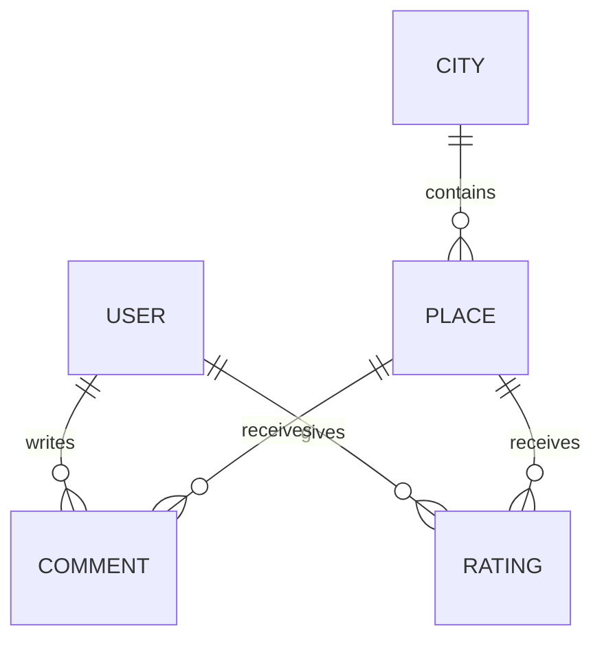

# Veritabanı Şeması Taslağı

Bu doküman, Akıllı Şehir Gezi Rehberi projesinde kullanılacak temel veri yapılarını ve aralarındaki ilişkileri açıklar.

## Amaç

Veritabanı yapısı; şehirleri, gezilecek yerleri, kullanıcıları, yorumları ve puanlamaları saklamak için tasarlanmıştır.

---

## Entity Yapıları

### City

Şehir bilgilerini tutar.

Alanlar:
- id
- name
- country
- description
- imageUrl

---

### Place

Gezilecek yer bilgilerini tutar.

Alanlar:
- id
- name
- description
- category
- address
- imageUrl
- cityId

---

### User

Kullanıcı bilgilerini tutar.

Alanlar:
- id
- username
- email
- password

---

### Comment

Kullanıcı yorumlarını tutar.

Alanlar:
- id
- content
- userId
- placeId

---

### Rating

Kullanıcı puanlarını tutar.

Alanlar:
- id
- score
- userId
- placeId

---

## İlişki Diyagramı

