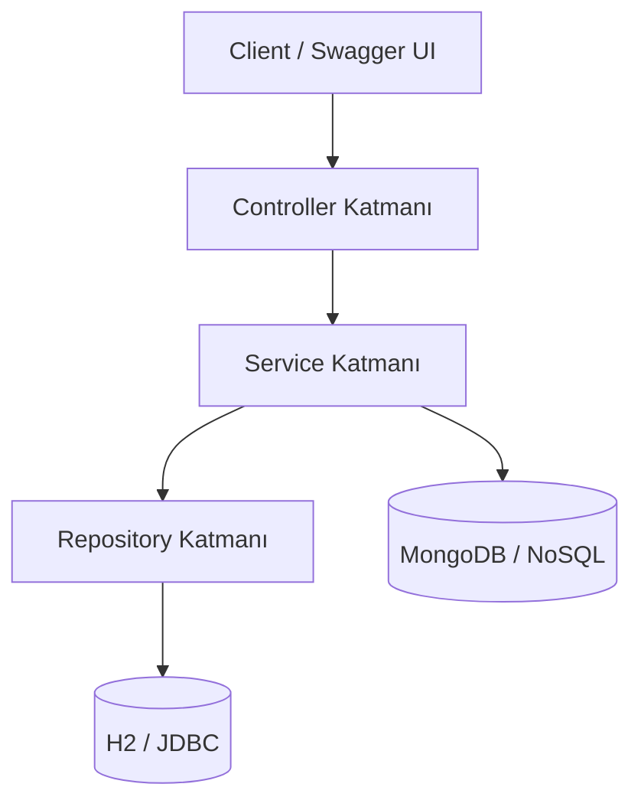
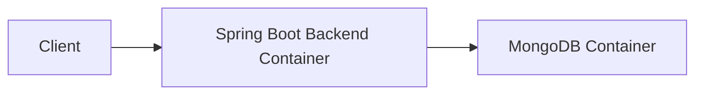

# Teknik Mimari Dokümantasyon

## Genel Mimari

Proje Spring Boot tabanlı REST API mimarisi ile geliştirilmiştir.  
Sistem katmanlı mimari yapısına uygun şekilde tasarlanmıştır ve hem ilişkisel veritabanı hem de NoSQL veritabanı desteği içermektedir.

---

## Kullanılan Teknolojiler

- Java 21
- Spring Boot 3
- Spring Data JPA
- Hibernate ORM
- H2 Database
- MongoDB
- Swagger / OpenAPI
- Docker
- Docker Compose
- JUnit 5
- Mockito
- Maven

---

## Katmanlı Mimari



---

## Katman Açıklamaları

### Controller Katmanı
HTTP isteklerini karşılayan REST endpoint yapıları bu katmanda bulunmaktadır.

### Service Katmanı
İş kuralları ve uygulama mantığı bu katmanda yönetilmektedir.

### Repository Katmanı
Veritabanı işlemleri Spring Data JPA ve MongoRepository kullanılarak gerçekleştirilmektedir.

### SQL Veritabanı
Şehir, kullanıcı, mekan, yorum ve puanlama gibi ilişkisel veriler H2 veritabanında tutulmaktadır.

### NoSQL Veritabanı
Favoriler, seyahat planları ve son aramalar gibi esnek veri yapıları MongoDB üzerinde saklanmaktadır.

---

## Ana Modüller

- City API
- Place API
- User API
- Rating API
- Comment API
- Favorite NoSQL API
- Travel Plan NoSQL API
- Recent Search Cache API

---

## Docker Yapısı



---

## Uygulamanın Çalıştırılması

Docker ortamında uygulamayı çalıştırmak için:

```bash
docker compose up --build
```

Swagger arayüzü:

```text
http://localhost:8080/swagger-ui/index.html
```