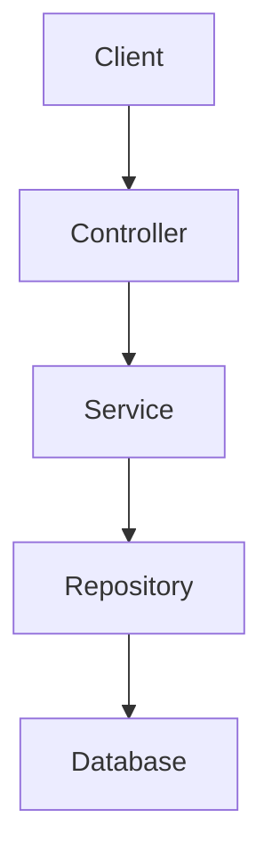

# 1. Hafta Çalışma Özeti

## Hafta Konusu

Kurulum ve sözleşme

---

## Amaç

Bu haftada projenin temel Spring Boot backend iskeletinin kurulması, entity yapılarının hazırlanması ve API ile veritabanı taslaklarının oluşturulması amaçlanmıştır.

---

## Yapılan Çalışmalar

- Spring Boot backend projesi oluşturuldu
- Proje klasör ve package yapısı düzenlendi
- Health endpoint eklendi ve test edildi
- City, Place, User, Comment ve Rating entity sınıfları oluşturuldu
- Repository katmanı oluşturuldu
- Service katmanı oluşturuldu
- Controller (API) katmanı oluşturuldu
- Veritabanı şeması taslağı hazırlandı
- API sözleşmesi taslağı hazırlandı

---

## Katmanlı Mimari

---

## Sonuç

1. hafta sonunda projenin temel backend yapısı oluşturulmuş, veri modeli belirlenmiş ve API sözleşmesi hazırlanmıştır. Proje çalışır durumdadır ve sonraki aşamalar için hazır hale getirilmiştir.